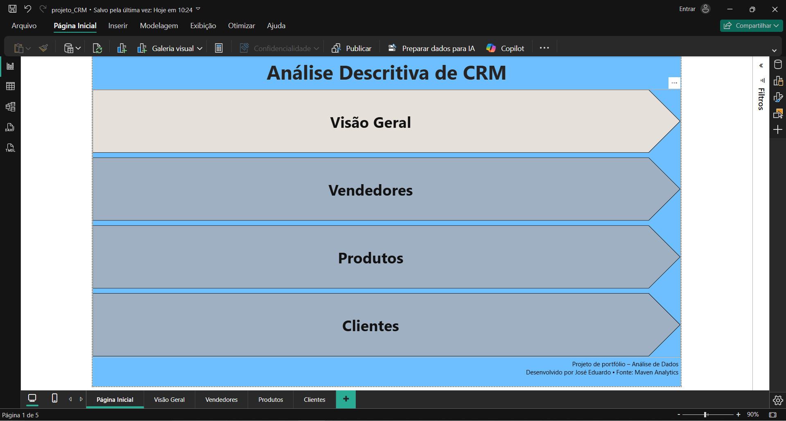
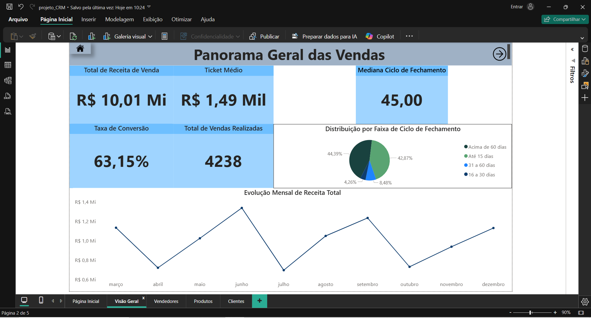
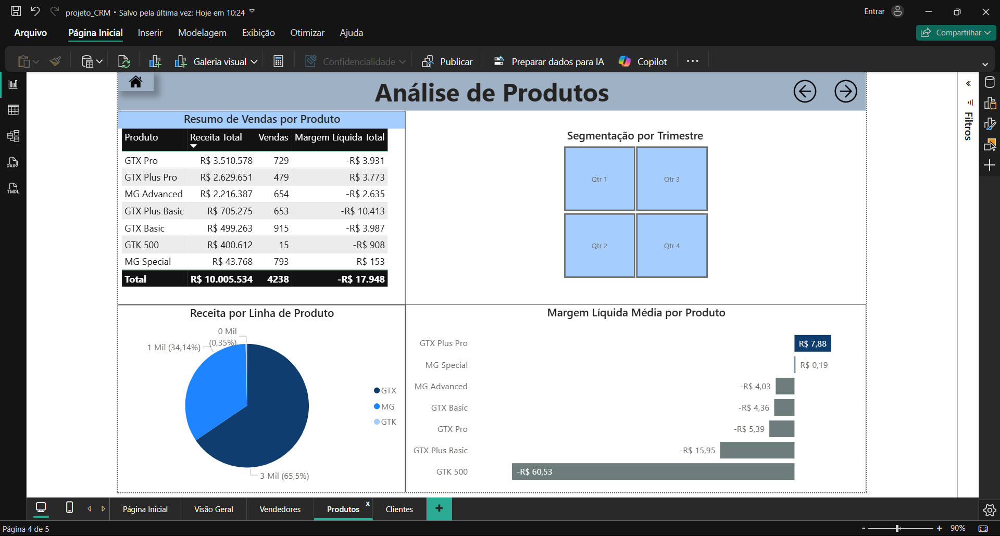
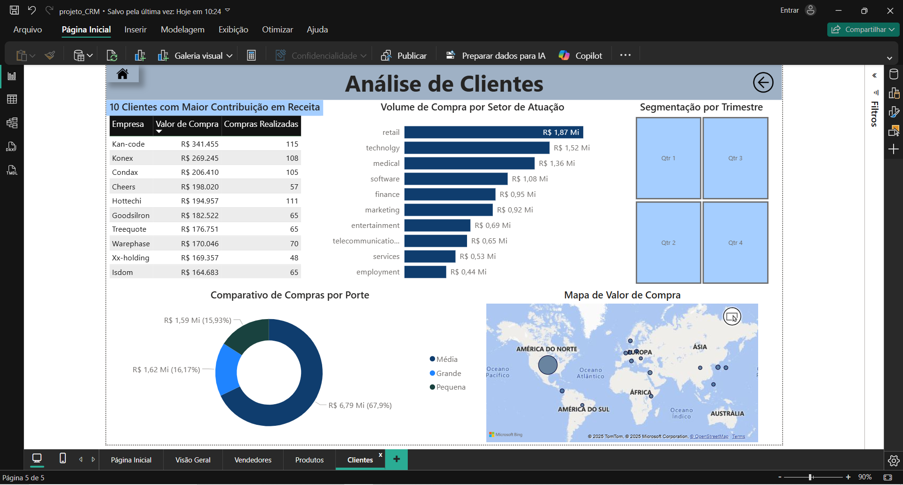

# 📊 Análise Descritiva de CRM no Power BI
Dashboard realizado para mostrar uma Análise Descritiva de um CRM de 2017 extraído do Maven Analytics. A análise abrange os principais aspectos de Vendas, Vendedores, Clientes e Produtos.

---

## 🧩 Sobre os Dados

Disponível em: [www.mavenanalytics.io/data-playground](https://www.mavenanalytics.io/data-playground)
O dataset contém quatro planilhas com dados referentes à:
- Dados de oportunidades (status, valor, datas)
- Time de Vendas 
- Clientes (Empresas)
- Produtos

---

## 🎯 Objetivos da Análise

- Monitorar o desempenho de vendas.
- Identificar vendedores com maior e menor rendimento.
- Identificar produtos com maior e menor volume de vendas.
- Observar tendências por porte de empresa e região.
- Medir o desempenho de cada escritório.

---

## 📌 Principais KPIs
- 💰 Valor Total em oportunidades ganhas
- ✅ Quantidade de oportunidades ganhas
- 💰 Ticket Médio
- 🕒 Tempo médio de fechamento
- 📈 Taxa de conversão por oportunidade

---

## 📈 Visões Criadas

- **Painel Geral interativo de Vendas no Ano**
- **Análise por Vendedor**
- **Análise por Produto**
- **Análise por Cliente**

---

## 🛠️ Ferramentas Utilizadas

- **Power BI Desktop**
- Modelagem de dados
- Power Query para ETL
- Medidas DAX
- Visualizações interativas

---

## 📚 Dicionário de Dados

| Tabela           | Campo              | Descrição                                                        |
| ---------------- | ------------------ | ---------------------------------------------------------------- |
| `accounts`       | `account`          | Nome da empresa                                                  |
| `accounts`       | `sector`           | Setor da empresa                                                 |
| `accounts`       | `year_established` | Ano de fundação                                                  |
| `accounts`       | `revenue`          | Receita anual (em milhões de USD)                                |
| `accounts`       | `employees`        | Número de funcionários                                           |
| `accounts`       | `office_location`  | Localização da sede                                              |
| `accounts`       | `subsidiary_of`    | Empresa controladora                                             |
| `products`       | `product`          | Nome do produto                                                  |
| `products`       | `series`           | Série ou linha do produto                                        |
| `products`       | `sales_price`      | Preço de venda sugerido                                          |
| `sales_teams`    | `sales_agent`      | Nome do vendedor                                                 |
| `sales_teams`    | `manager`          | Gerente responsável                                              |
| `sales_teams`    | `regional_office`  | Escritório regional                                              |
| `sales_pipeline` | `opportunity_id`   | Identificador único da oportunidade de venda                     |
| `sales_pipeline` | `sales_agent`      | Nome do vendedor                                                 |
| `sales_pipeline` | `product`          | Nome do produto ofertado                                         |
| `sales_pipeline` | `account`          | Nome da empresa prospectada                                      |
| `sales_pipeline` | `deal_stage`       | Etapa da negociação (Prospecção > Engajamento > Ganha / Perdida) |
| `sales_pipeline` | `engage_date`      | Data de início da etapa de engajamento                           |
| `sales_pipeline` | `close_date`       | Data de fechamento da oportunidade (ganha ou perdida)            |
| `sales_pipeline` | `close_value`      | Receita gerada com o fechamento da oportunidade                  |

---

## 📷 Preview do Dashboard

---

## 🗂️ Arquivo
[`projeto_CRM.pbix`](./projeto_CRM.pbix)

---

## 🎯 Insights Obtidos
- Ciclo de Fechamento é de **45 dias**, porém existe uma grande parcela (43%) abrangendo um período de até 15 dias.
- **Junho** foi o mês com mais vendas no ano.
- Dentre os vendedores, para grandes faturamentos destaca-se **Darcel Schlecht** e para menores **Lajuana Vencill**.
- Os produtos mais vendidos são da categoria **GTX**, se destacando tanto em volume de vendas quando em receita.
- O país que mais comprou foi disparadamente os **Estados Unidos**.
- Empresas de **médio porte** representaram a maior parte das vendas.
